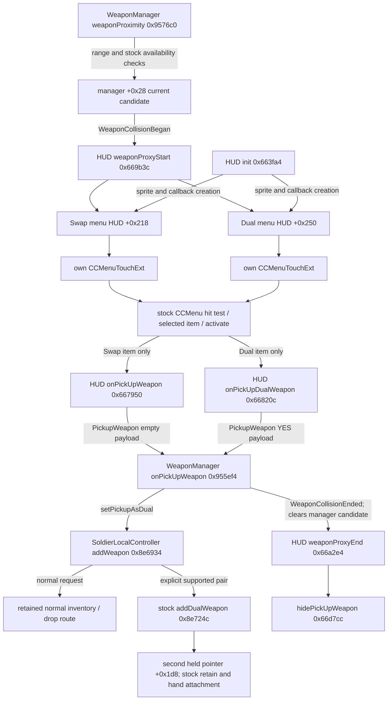

# Phase 5 — Separate Swap and Dual pickup actions

## Status

The user confirms the preceding SPAS + SPAS build holds both shotguns simultaneously. This Phase 5 SPAS UI candidate is built, structurally verified, installed and launched on device `241266d60c20`. **Physical SPAS Test A passed:** user confirms both actions work, both guns fire and buttons hide. Broader regression results remain pending. The task is not complete. Shared pair-policy generalization and a sniper candidate are implemented; sniper physical Test B and broader regression/LAN remain pending.

Current APK: `builds/universal_dual_wield_ui_standalone/mmc-spas-two-action-pickup-experimental.apk`. Four signed splits: `builds/universal_dual_wield_ui_splits/`.

## Root cause

The original game already creates two independent menu items. HUD +0x218 is the circular-arrow pickup/Swap item (`wepChangeBtn.png`) bound to `HUD::onPickUpWeapon`. HUD +0x250 is the two-gun item (`dualBtn.png`) bound to `HUD::onPickUpDualWeapon`. They have separate callbacks and touch menus.

Normal posts `PickupWeapon` with an empty string; Dual posts it with `YES`. `WeaponManager::onPickUpWeapon` tests whether the payload string is nonempty, writes Weapon's `pickupAsDual` flag via virtual +0x620, and calls controller addWeapon via +0x5b0. The original addWeapon reads that flag via +0x618. The preceding SPAS experiment replaced the ensuing branch with an unconditional jump into its SPAS pair stub and ignored the flag. This made either request activate a SPAS dual pair. The HUD's original classification checks also hid the Dual item for SPAS, leaving the circular-arrow action as the only visible button.

## Verified pickup and touch call graphs

Addresses here are ELF virtual addresses. In these executable segments they equal file offsets. Ghidra displays a +0x100000 image bias. Patch scripts independently map PT_LOAD and validate the exact input hash, function sizes, replacement bytes, bounds and complete mutation scope.

HUD init constructs each item from its own normal/selected sprites, creates one CCMenuTouchExt per item and retains the menus in its vector. The touch wrapper at ELF 0x5b2dd0 delegates begin to CCMenu::ccTouchBegan, records the accepted touch, then forwards movement and release through 0x5b2ecc/0x5b2ffc. CCMenu touch hit testing and item activation are unchanged. `HUD::touchBeganHandler/touchMoveHandler/touchEndHandler` forward joystick touches to Joypad; they are not the pickup item callbacks. Controller events PressRButton/PressLButton separately call `onPressPickupButton` 0x66abec / `onPressPickupDualButton` 0x66ac1c, then the same independent action handlers.

Both handlers check their own item's visibility before notifying. No extra callback, new overlapping menu, shared input event or retained nearby reference is introduced.

## Range, removal and lifetime

Stock weaponProximity selects the nearest valid candidate within the existing weapon pickup radius. It clears manager +0x28 and posts WeaponCollisionEnded when the candidate is outside range or the local player is dead. Stock canTeamPickup and item checks remain. `removeItemFromWorld` 0x958b28 compares the removed item's UUID with the current candidate, clears the candidate and posts the end event before removing dictionary references. Item/peer removal paths use this existing cleanup. Pickup fetches the manager's current candidate, rather than a HUD-owned raw pointer, and clears it after handling. No new candidate cache or asynchronous pickup request is added.

The controller also rechecks the incoming pointer against all three owned slots and validates the current SPAS/empty-dual state for an explicit Dual request. An unavailable ordinary Dual request does not fall through into normal Swap. This guard supplements stock candidate cleanup; it does not establish LAN race correctness without physical two-device tests.

## Native implementation

All changes layer on the exact user-confirmed native SHA `b6f87aed1e1898c55b726720d6cb45d0796d54177ce94ed0be2c64d889262102`. That complete build and its documents/scripts were snapshotted in `backup/dual-wield-ui-20261008/`, with verified hashes for 16 files.

| ELF/file offset | Bytes | Change and reason |
|---|---:|---|
| 0x8e6990 | 196 | Save original pickupAsDual return in existing stack scratch. Reject aliased pointers. Normal requests rejoin 0x8e6cac working carried routing. Explicit Dual admits only type-9 primary + type-9 incoming with empty dual slot, using stock addDualWeapon. Existing dedicated dual-only utility routing is retained. |
| 0x669c14 | 4 | Jump to UI policy after existing slot caching, hiding and position reset. |
| 0x669d00 | 188 | SPAS pair goes to existing both-button block 0x669f84. No primary, incompatible gun or occupied dual slot shows normal only. Null/already-owned incoming reference hides both. Dedicated dual-only utility retains its original supported display path. |
| 0x957aa4 | 4 | NOP the stock early return when primary and dual both match the candidate. This allows normal Swap near a third matching gun. All following availability/team/range checks remain. |

Full original/replacement bytes, assembly, disassembly, sizes and verified file mappings are in `verification.json` and `reports/dual-wield-ui-evidence/package-verification.json`. These four executable spans are the only mutations. The original AAPCS64 frames, saved registers and epilogues are retained. UI slot caching and labels remain stock; the old primary-only locals are bypassed and not consumed by the new policy.

The confirmed SHOTGUN dual configuration relocation is preserved exactly: class slot +0x3d8 resolves to SHOTGUN::setPrimaryConfiguration. Primary and dual hand attachment, aim, fire dispatch, muzzle transforms, independent weapon state and stock retain/release remain unchanged. No native allocation, projectile duplication, ownership transfer or new network protocol is introduced.

## Visible behavior and occupied hands

For one active SPAS near another SPAS: both circular-arrow Swap and two-gun Dual appear. Swap makes the nearby gun active through the previous normal carried/replacement path; it does not activate simultaneous dual wield. If the back slot is empty, the old gun may be stowed under the existing carried rules. Dual retains the active SPAS and assigns the new instance to the opposite hand. An existing stowed slot remains independent.

No active weapon: normal pickup only. Unsupported ordinary pair: normal action only. No valid pickup: both hidden. Both hands occupied: Dual is hidden; its stale request is rejected. Normal Swap follows the existing inventory/drop route and can drop the prior dual gun through stock switchWeapons/addPrimaryWeaponRemoveDual behavior. Replacing only the second held gun is not enabled yet; that requires separate lifecycle and LAN verification.

The stock both-button block uses existing PICK_SCL and DUAL_SCL and offsets co-located controls by +38 and -38 scaled units. At equal scales the centers separate by 76 units for 67-unit icons, leaving a 9-unit gap. Tests exercise scales 0.5, 1 and 1.5 and preserve explicitly distinct configured positions. Normal/selected sprite appearance, opacity, touch feedback and screen/layout preferences remain unchanged. Different aspect ratios, actual hitboxes and clearance from other controls still require physical observation.

## Universal compatibility investigation and extension plan

The recovered factory roster has 37 directly verified ItemType-to-class mappings with create PLT/GOT and primary/dual/triggerPull virtual targets in `weapon-roster.json`. The stock fire dispatcher already calls the two independent instances, preserving each class's trigger method and timing. This is reusable infrastructure, not proof that every weapon's rendering, recoil and projectiles work in dual state.

Relevant factory classes include SHOTGUN type 9, M93BA type 10, SMAW type 11, ROCKET type 12, M14 type 16, MP5/AK47/M16 types 6/7/8, UZI type 5 and DEAGLE/MAGNUM types 3/4. User-facing weapon labels and launchable/projectile versus held-gun semantics must be reconciled with metadata before adding a class. The factory also includes knives, explosives, shield, power-ups and objective items; those must not be admitted as guns merely because they inherit Weapon.

Many larger guns have an empty inherited dual transform; others have class-specific dual transforms. Expand the shared eligibility policy and class-scoped configuration targets one recovered gun class at a time after SPAS UI Test A. Reuse stock per-instance triggerPull/update/muzzle/doFire paths. Verify the existing primary transform in the opposite hand, aiming and flipping first; add a class-specific transform only if it fails. Then test same-class firing/reload/drop/respawn and mixed pairs. No generalized classes are enabled in this candidate before physical action-selection confirmation, as required by the testing order.

The earlier report establishes a remote controller dual slot/hand path, but private LAN action/weapon/projectile round trips are unverified. No public server or authentication changes are made.

## Tests and deployment

Automated: 176 ARM64 cases PASS. They execute real addWeapon and HUD show/hide/layout instructions while simulating Cocos/ownership callbacks. Covered normal pickup preservation, explicit Dual activation, invalid Dual rejection, null and aliased pointers, occupied hands, utility routing, enabled/disabled controls, three scales, custom positions and stock proximity-end reset. These tests do not render pixels, test Android touches, create physics projectiles or prove private LAN behavior.

Package checks PASS: exact native mutation scope and bytes, working gameplay functions, signature certificate, ZIP CRC, uncompressed split native entries, 4096-byte native alignment and other application payload equality. Python/shell syntax checks and backup hashes PASS.

All four splits installed successfully; installed ARM64 split matches the built artifact byte-for-byte. Launch command succeeded. No uninstall or app-data clear was issued. Manual Test A passed after launch: user reply “Both actions work; both guns fire; buttons hide”. This exact UI build is now preserved in backup/dual-wield-ui-verified-20261008/.

| Physical requirement | Result |
|---|---|
| Previous SPAS pair simultaneously held | USER CONFIRMED in Phase 5 handover |
| New two icons / independent actions | USER CONFIRMED |
| Swap only normal pickup | USER CONFIRMED |
| Dual holds and fires both SPAS | USER CONFIRMED |
| Buttons hide outside range | USER CONFIRMED |
| Ammo, reload, fuel, flight, aim | PENDING; working code preserved |
| Drop, death, respawn, no crashes | PENDING |
| Other same/mixed pairs | Test A passed; sequential extension in progress |
| Private LAN | GATED ON OFFLINE TESTS |

Reinstall/update: `./scripts/deploy_dual_wield_ui.sh 241266d60c20`. Verify: `python3 scripts/build_dual_wield_ui.py --verify`. ARM64 tests: `PYTHONPATH=/tmp/mmc-unicorn-tests:scripts python3 scripts/test_dual_wield_ui_arm64.py`. Roster audit: `python3 scripts/audit_dual_wield_ui.py`. Builders refuse output overwrite.

Rollback to the confirmed SPAS build: `./scripts/deploy_true_dual_wield.sh 241266d60c20`. Data is retained. Avoid obsolete combined RET-ammo builds.

## Manual checklist

1. Offline, hold one SPAS and approach another: confirm circular-arrow and two-gun buttons, matching style and safe placement.
2. Press circular-arrow Swap: nearby gun becomes active; no opposite-hand activation. Inspect normal stow/drop behavior.
3. Repeat from the single-held state; press two-gun Dual: confirm each hand has a SPAS, both aim and both fire with separate muzzles.
4. Leave pickup range; both buttons disappear. Re-enter, remove/pick up the item; both disappear after consumption. While both hands hold SPAS, approach another; only Swap should be available.
5. Test each facing direction, flight/boost, sustained firing, manual reload, drop/re-pickup, death/respawn, ordinary single pickup and crashes. Report any failure before expansion.
6. After Test A passes, enable and test the remaining gun classes sequentially and then mixed pairs. Private LAN follows offline regression, with two consenting phones.

Candidate native SHA-256: `77f075ede045373df1f631b2cea0f0ce421bab0f971214e9c38e235de5a87191`.
Standalone APK SHA-256: `6a804081c500a1edfa6cf68f0cea7def161c43ccceec9a9ca6f1ddd84064fdd0`.

Verified Cocos touch internals: CCMenu::registerWithTouchDispatcher at ELF 0xc6ccec registers a targeted delegate with swallowTouches=true. ccTouchBegan 0xc6cd70 checks menu/parent visibility, calls itemForTouch 0xc6ce7c (visible and enabled item, node-space rectangle containment), stores the selected item and invokes selection. ccTouchEnded 0xc6d0d4 unselects and activates only that item. CCMenuItem::activate 0xc7082c resolves the stored member callback using the ABI adjustment fields and invokes it. These functions and menu registration are unchanged. See pickup-menu-decompiled.txt.

Next revision: [shared pair-policy/sniper candidate](dual-wield-ui-sniper.md), 428 ARM64 checks and package validation PASS. Physical sniper testing is pending; the installation attempt found the phone disconnected. The confirmed SPAS two-action build remains preserved.
